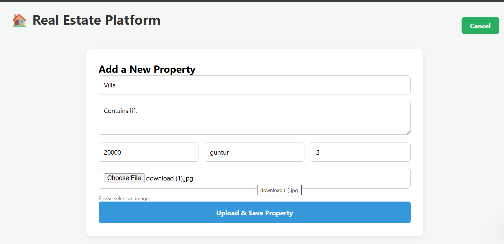
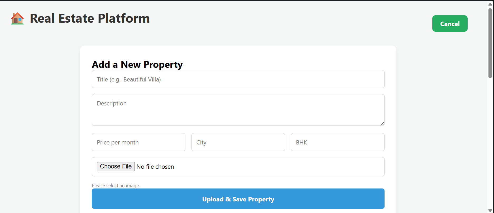
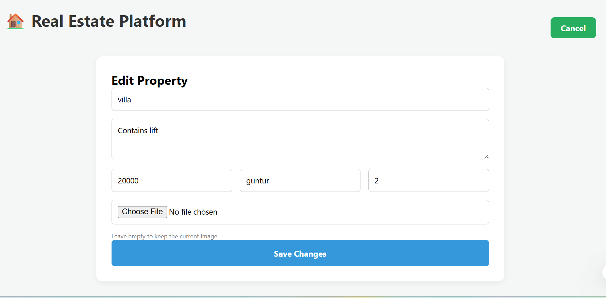
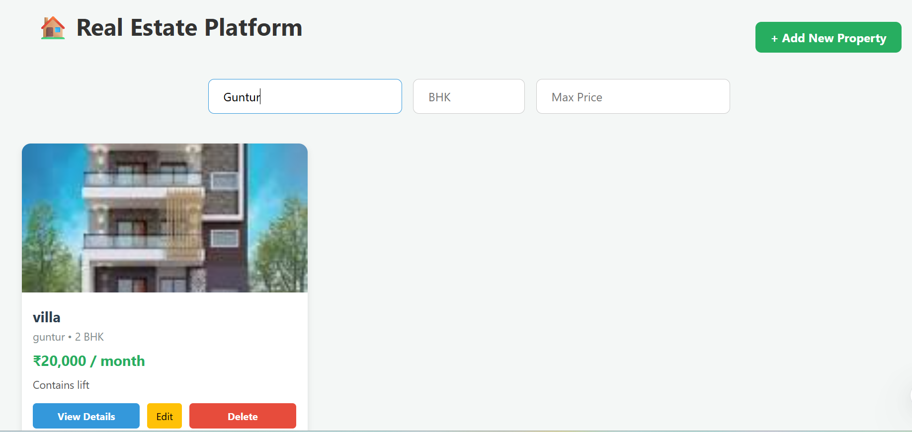
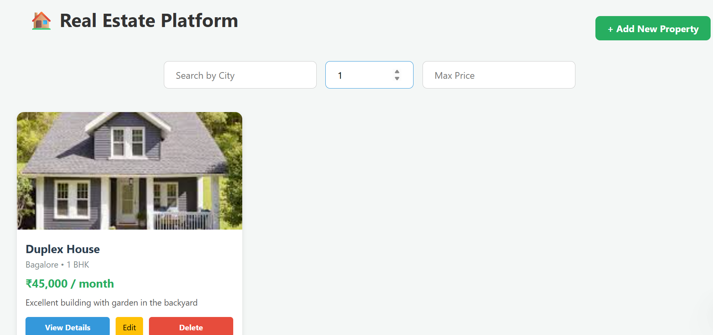
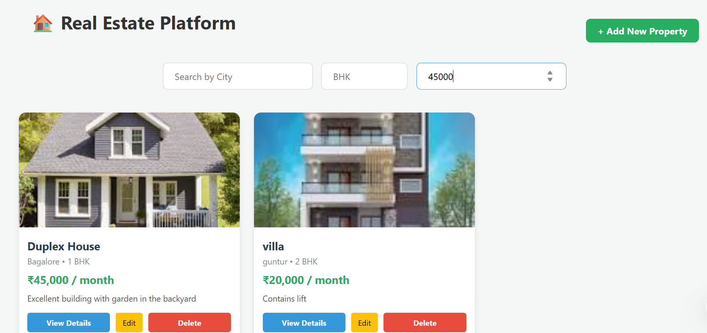

# 🏠 Real Estate Platform Frontend

A modern full-stack real estate web application frontend built using React.js that allows users to browse, search, add, edit, and delete property listings with image uploads.

---

## 📌 Project Overview

The Real Estate Platform helps users explore rental properties and manage listings through a clean and responsive user interface.

Users can:

- Browse available properties
- Search properties by city
- Filter properties by BHK and price
- Add new properties
- Upload property images
- Edit existing property details
- Delete property listings

The frontend communicates with a Spring Boot backend API deployed on Render.

---

## ✨ Features

### 🏘️ Property Management
- View all properties
- Add new property listings
- Edit property details
- Delete properties
- Upload property images

### 🔍 Search & Filters
- Search by city
- Filter by BHK
- Filter by maximum price

### 🖼️ User Interface
- Responsive design
- Property cards
- Property details modal
- Interactive forms

---

## 🛠️ Tech Stack

### Frontend
- React.js
- JavaScript
- CSS3
- Fetch API

### Deployment
- Vercel

---

## 📂 Project Structure

```bash
realestate-frontend
│
├── public
│
├── src
│   ├── App.js
│   ├── App.css
│   └── index.js
│
├── package.json
├── package-lock.json
└── README.md
```
---

## ⚙️ Installation & Setup

### 1️⃣ Clone Repository

```bash
git clone https://github.com/pranathi-rishika04/realestate-frontend.git
```

### 2️⃣ Navigate to Project Folder

```bash
cd realestate-frontend
```

### 3️⃣ Install Dependencies

```bash
npm install
```

### 4️⃣ Start Frontend Server

```bash
npm start
```

---

## 🌐 Deployment

Frontend deployed using Vercel:

https://realestate-frontend-cyan.vercel.app

---

## 🔗 Backend API

Backend deployed using Render:

https://realestate-backend-6p82.onrender.com

---

## 🗄️ Database Hosting

Database hosted using Railway MySQL.

---

## 📸 Screenshots

### 🏠 Home Page

Displays all available property listings in a clean card layout.



---

### 📄 Property Details Modal

Users can view complete property details in a popup modal.



---

### ✏️ Edit Property

Allows users to update property details and upload a new image.



---

### 🔍 Search by City

Users can search properties based on city names.



---

### 🏘️ Filter by BHK

Users can filter properties according to BHK type.



---

### 💰 Filter by Maximum Price

Users can filter properties based on maximum monthly rent.


